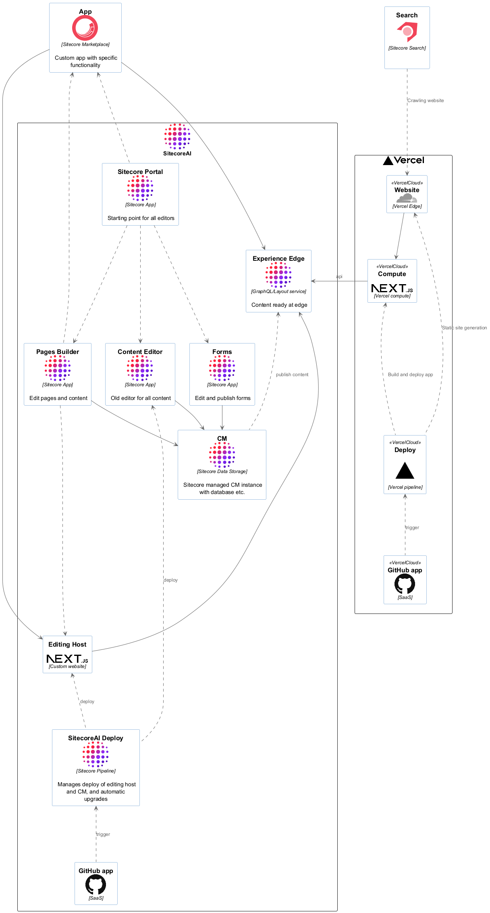

# Sitecore icon set for PlantUML

I like to make my architecture diagrams in [PlantUML](http://plantuml.com/) and have them in source control.

Inspired by [plantuml-icon-font-sprites](https://github.com/tupadr3/plantuml-icon-font-sprites), I copied the icons from Sitecore documentation and made sprites, so they can easily be used in diagrams.

All rights remain at [Sitecore](https://www.sitecore.com/), but I am pretty sure that we can use the icons for creating better solutions.

## How to use (SitecoreAI)

As the SitecoreAI logo is multi-colored, there is another procedure to use the image

```plantuml
!define SITECOREURL https://raw.githubusercontent.com/jballe/plantuml-sitecore-icons/refs/tags/v2025.1/sprites
!include SITECOREURL/common.puml
!include SITECOREURL/ailogo.puml

SITECORE_AI_LOGO(ai, "SitecoreAI", "SaaS")
```

[](./samples/sitecoreai.puml)


And more complex diagrams:

[](./samples/sitecoreai-architecture.puml)

## How to use (Sitecore 10 / XM Cloud)

```plantuml
!define SITECOREURL https://raw.githubusercontent.com/jballe/plantuml-sitecore-icons/refs/tags/v2025.1/sprites
!include SITECOREURL/common.puml
!include SITECOREURL/xmcloud.puml

SITECORE_XMCLOUD(xmc, "XM Cloud", "SaaS")
```

[](./samples/xmc.puml)


## How to use (Sitecore 9)

```plantuml
!define SC_SPRITESPATH https://raw.githubusercontent.com/jballe/plantuml-sitecore-icons/refs/tags/v2025.1/by-type/sc9-architecture
!includeurl SC_SPRITESPATH/common.puml
!includeurl SC_SPRITESPATH/scWeb.puml

SCWEB(cm, "Content\nManagement")
```

Will give you

[](./samples/sc9_simple.puml)

You can embed diagrams from public sources by using plantuml as above. For private repos I often generate an image url with the source embedded, like when using [PlantText.com](https://www.planttext.com/?text=VSwn2i8m58NXNUWxr4uADbS51zsq57GGYXLS14dJQnj9qfBSABwz4PqStCxmmVc7DLwbmRZCBcLns1tpibWVjt5BrBiLWEKFraXgVUKTMj4PGaDCT1fk5LSAeLVSaDSgTP9GT1PJ6PG3YrS7n1i7z_bqlc0pg9ufFNi49vOfjw9zU_8Mey5G6g5yZTwgdmu8Jxeph0yFVvqJ9wo-B1gKsIdVZ8IUn4dsIJwRFJUyGHrsCdu1)

I can also recommend the [VS Code extension for PlantUML](https://marketplace.visualstudio.com/items?itemName=jebbs.plantuml)
